# 本能覚醒！DXジュウオウチェンジャーを電話にする

2016年放映「動物戦隊ジュウオウジャー」の変身アイテム「変身携帯 DXジュウオウチェンジャー」は、携帯電話の形をしていますが実際に電話をすることはできませんので、Twilioと3GラズパイとLightBlue Beanを使って電話機能を追加します。

変身携帯 DXジュウオウチェンジャーとはこんなものです。

[](https://www.youtube.com/watch?v=2Ev9Jpj676g)

(YouTubeで動画されている方がいたのでリンクはらせていただきました)

出来上がりはこんな感じになります。

[](https://www.youtube.com/watch?v=ayybI7RHh8Y)

(YouTube動画へのリンクです)

# 使ったもの

+ [変身携帯 DXジュウオウチェンジャー](http://www.bandai.co.jp/catalog/item/4549660038665000.html) 定価4298円
+ [Raspberry Pi Model B](https://www.raspberrypi.org/products/raspberry-pi-3-model-b/)＋[3GPI](http://www.mechatrax.com/products/3gpi)＋[SORACOM Air SIM](https://soracom.jp/services/air/) / [関連記事](http://mag.switch-science.com/2014/12/05/3gpi/)
+ [LightBlue Bean](http://store.punchthrough.com/collections/all/products/bean) $30+輸送料
+ [iBUFFALO USBヘッドセット BSHSUH11SV](http://buffalo.jp/product/multimedia/headset/bshsuh11sv/) 定価2660円
+ [iBUFFALO Bluetooth4 USBアダプター BSBT4D09BK](http://buffalo.jp/product/peripheral/wireless-adapter/bsbt4d09bk/) 定価2390円
+ ラズパイ用SIPクライアントとして[PJSIP/PJSUA](http://www.pjsip.org/pjsua.htm)
+ [Twilio](https://jp.twilio.com/) 体験用アカウント + グローバルIPアドレスのあるLinuxマシン（[Nifty Cloud](http://cloud.nifty.com/)使用） + Ubuntu + [Asterisk](http://www.asterisk.org/) で構成したSIP電話バックエンド / [関連記事](http://qiita.com/sgrowd/items/dd1fc682718a2a623e4c)

※ソースコード等は[GitHubに置いてあります](https://github.com/sowd/ZyuohPhone)。[pi/以下](https://github.com/sowd/ZyuohPhone/tree/master/pi)がラズパイのnode.js用プロジェクト、[ZyuohChanger/ZyuohChanger.ino](https://github.com/sowd/ZyuohPhone/blob/master/ZyuohChanger/ZyuohChanger.ino) がLightBlue Bean用のArduino Sketchです。便利かと思ってpi/の下に[PJSIP/PJSUAをラズパイ上でコンパイルしたバイナリつきソースを全部置いた](https://github.com/sowd/ZyuohPhone/tree/master/pi/pjsip/trunk)ら140MBくらいになってしまいました。すみません。

なお、Zyuohという綴りが間違いじゃないかと思われるかもしれませんが、これは公式の綴りです。


# 下準備

以下の作業は本記事の中では解説しませんが必要なことですので、リンク先などを見ながら実施をお願いします。

+ [Twilioを用いたSIP電話のバックエンド構築](http://qiita.com/sgrowd/items/dd1fc682718a2a623e4c) (グローバルIPアドレスが必要)
+ [ラズパイを3GPIとSIMで通信できるようにする](http://mag.switch-science.com/2014/12/05/3gpi/) (組み立てるだけ。ソフトの設定不要)
+ GitHubに置いてある[ZyuohChangerスケッチ](https://github.com/sowd/ZyuohPhone/tree/master/ZyuohChanger)を[LightBlue Beanに書き込む](https://punchthrough.com/bean/guides/getting-started/intro/)。さらに、LightBlue Beanデバイスの名前を「ZyuohChanger」にしておく (大事)

ラズパイは3GPIというシールドを使い、SORACOM Air SIMを載せて通信していますのでEthernet等は不要です。
音声を通すので、SIMは帯域の大きいものの方がいいかも。

# ハードウェア制作

ジュウオウチェンジャーはおおまかに3つのパーツからなる立方体の形をしていて、電子回路が入っているのは一番下のプッシュボタンがついているところだけです。いちばん上部のパーツが回るようになっていたり、開閉も動作に影響しますが、突起物の動きによって機械的に一番下のパーツに情報伝達しています。

[](https://www.youtube.com/watch?v=2Ev9Jpj676g)

この一番下の部分を開けて、ボタンを押したときにそれをLightBlue BeanのGPIOで読み取れるようにします。

ボタン読み取り基盤は横３×縦４のグリッド状の回路になっています。

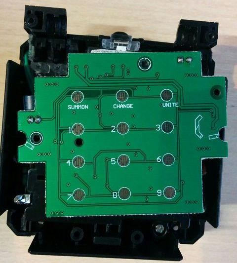

これ以外にも、チェンジャーの開閉や上部の回転を読み取ることもできます。LightBlue BeanのGPIOはデジタル6本、アナログ2本しかありませんので、今回は全ボタン＋開閉のみ読み取ることにします。

プッシュボタン信号は、キーマトリックスといって[縦方向と横方向の組み合わせで読み取るようになっている](http://www.ei.fukui-nct.ac.jp/~t-saitoh/exp/h8/key-matrix.html)ので、12個ボタンがあっても横３＋縦４の合計７ビットで読み取りできます。

このようなキーマトリックスを自前で作る場合、縦か横のどちらかは入力、もう一方は出力にするのですが、なるべく元の玩具の機能を殺さずに機能追加したいため、どちらもLightBlue Beanで読み取って、チェンジャー側の読み取りタイミングで同時にデータを取り込むことにします。


基盤を裏返してみると、ところどころ銀色の丸いパターンがありました。ここがスルーホールを介してキーマトリックスに直結しているようだったので、接続を確認しながらケーブルを半田付けしていきます。

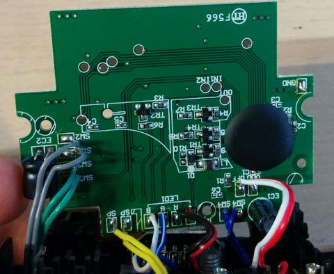

こんな感じで、とっても半田付けしやすいです。

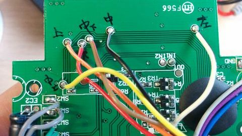

しかし、どうしても一カ所だけ、丸いパターンがない端子がありました。この黒い部分の下に隠されてしまっているんでしょうか。

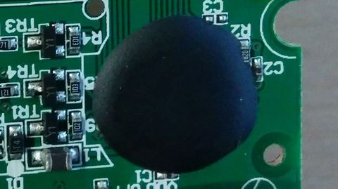

こういう黒い部分は、中に大事なICが入っていたりするのでおいそれと剥がすことはできません。

途方にくれていたところ、会社でノートPCを作っていたこともあるスーパーエンジニアの方が「パターンをカッターでこすれば被膜がはがれてはんだ付けできるようになるよ」と教えてくれたのです！
一緒に中の配線も削ってしまいそうだし、そもそもそんなことやろうと思ったこともなかったのですが、簡単だよと言われてやってみました。

ここに狙いをつけました。カッターでカリカリカリ…とこすります。
まわりも削ってしまうと、はんだ付けの時にショートしてしまうかもしれないので割と細かい作業になります。

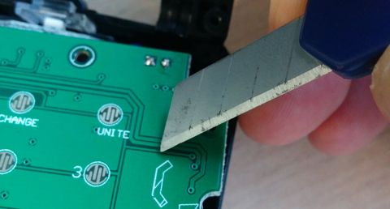

被膜がはがれた！

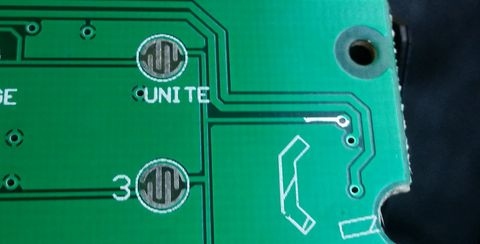

そこに半田を盛って…

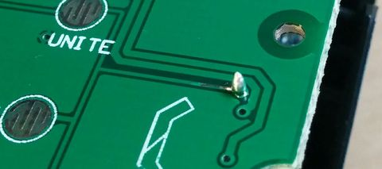

ケーブルもはんだ付けできました！やった！

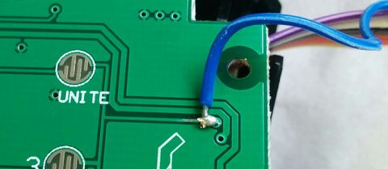

スーパーエンジニアの方、どうもありがとうございました！

あと、チェンジャーの開閉を入力するスイッチもつないでいます。
下図の、電解コンデンサーのちょっと右にある二本の青いケーブルが開閉スイッチにつながっています。この右側とGPIOをつなげばOK。僕はA0とつなぎました。

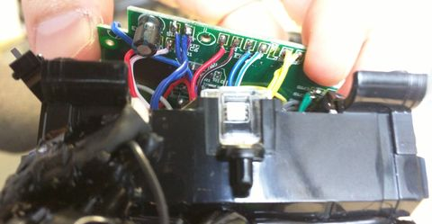

本体内にLightBlue Beanを入れる隙間はなさそうだったので、ケーブルはケースの外に引き出すことにしました。超音波カッターで穴をあけてケーブルを逃がします。

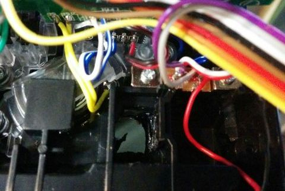

外から見たところ

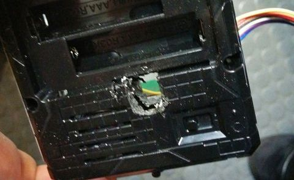

ケーブルを出してきます。

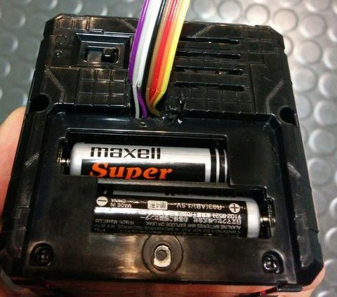

それでもケーブルの厚みがあるので、ふたを閉めるとパンパンです。プッシュボタンのある面が心なしか膨らんでまがっているのがお分かりでしょうか。

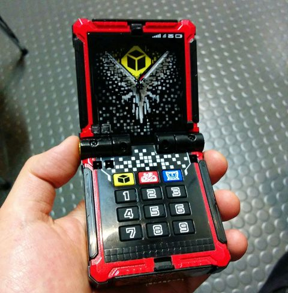

かなり不格好ですが、元あった蓋の代わりにLightBlue Beanで電池を押さえることにしました。実際にはおさえきれていなくて、激しく振ると電池が少し飛び出してきます^^;
なお、LightBlue Beanの電源3Vもこの電池からとってくるようにしています。割と電圧降下しているみたいで、LightBlue Beanの動作は若干怪しくなってしまいました。

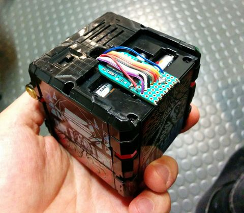

さてお次はスピーカーとマイクです。
LightBlue BeanがBLEで無線通信なので、音声も無線にしたいと思い、Bluetoothヘッドセットを使って作ろうと思っていたのですが、どうやらラズパイでBTのマイクを使うのは[現時点では難しいらしくて](https://www.raspberrypi.org/forums/viewtopic.php?f=28&t=148832)、非常に不本意ながら今回はUSBの有線ヘッドセットを使うことにしました。中にはチップ固有ファームを使って成功した人もいるようですが、私はそこまでやるパワーはないので…

今回有線になってしまったのはこれが原因です。こっちも無線にできたらかっこよかったのになあ。今回最も悔しい点です。

で、[iBUFFALO USBヘッドセット BSHSUH11SV](http://buffalo.jp/product/multimedia/headset/bshsuh11sv/)というのを使ったらすんなり使えました。ノイズキャンセリング機能も入っているらしく、音もきれいだと思います。

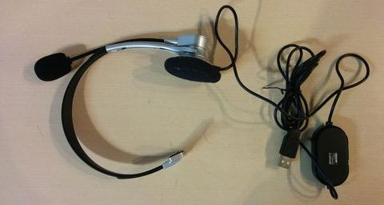

チェンジャーに組み込むために解剖していきます。このスピーカー部分、白い台に接着されています。台があるとチェンジャーに入れられないので、スピーカーだけ切り離します。ここはデリケートな部品なので注意してください。私はひとつ壊しました（泣）

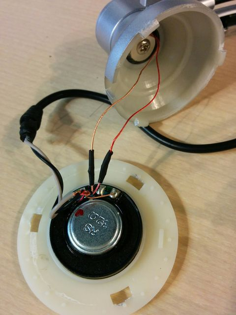

マイクはアームの先についています。アームは針金が仕込まれたゴムチューブにすぎませんので、中の線に傷をつけないように注意深くハサミかなんかで斬っていきます。外すとこうなります。

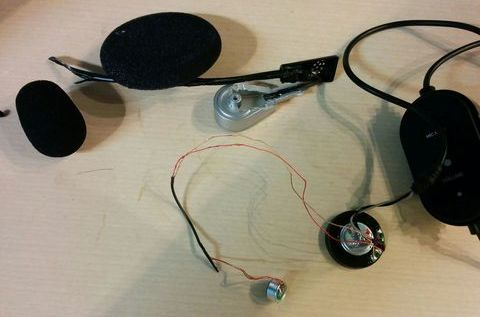

無理やり引っ張ってしまって線がぼそぼそになってしまったところがあります(再度苦笑）

この状態で断線してないか確認したら、チェンジャーの中に入れ込んでいきます。
もうスペースがパンパンで入れられるところが少ないのですが、キーマトリックスの右下にちょっとだけ使えそうな場所を見つけました。
この下は電池が入っていますが、少し削ればマイクが入る場所くらいはありそう。

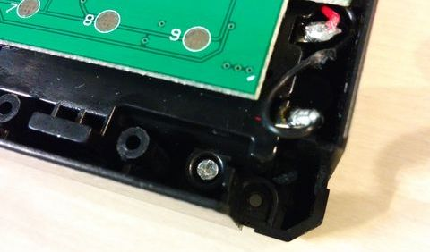

ということで、超音波カッターで切ってスペースを作ります。向こうの電池が見えています。
気分は手術ですね！

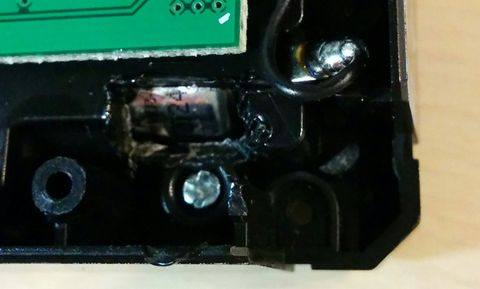

ここにマイクをはめ込みます。

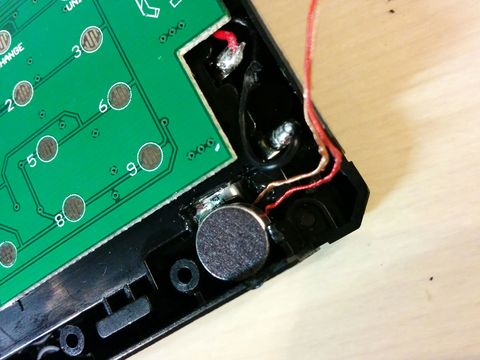

マイクを固定させるためにグルーガンを使いました。
あと、さっきぼそぼそさせてしまったケーブルがどっかにショートするのが怖かったので、チューブでシールドしました。

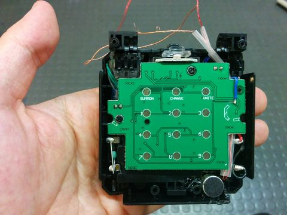

もうこれ以上入らないよ…

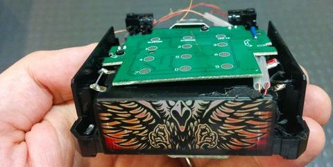

また、上蓋の一部がマイクにあたってしまったので、上蓋も少し削りました。

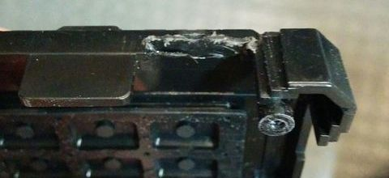

収まりはこんな感じになります。

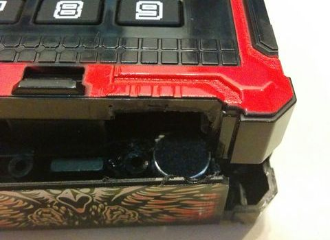

マイク部分には音が通るように穴をあけておきます。
これで無理やり上蓋をねじ留めすれば、マイク部分は完成です！

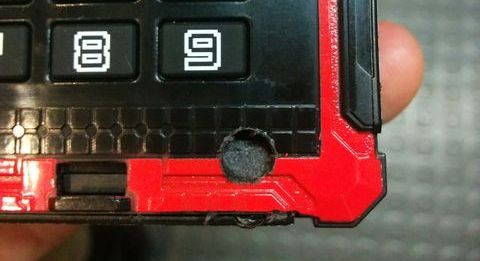

次はスピーカーです。電子回路が何も入っていない、中段の部分に入れます。
ここは開けるとこんな感じになっています。薄いモノなら入れられそう。
やってみたら先程のスピーカーがちょうど入るサイズでした。

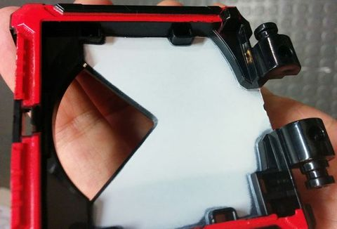

ここには透明の蓋がつけられていました。ここの接合部をちょっとだけ削って、ケーブルを後ろに逃がせるようにしましょう。

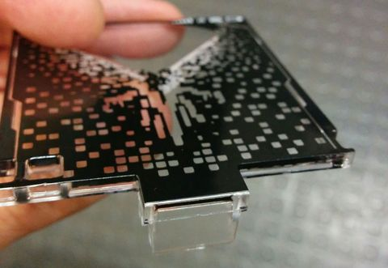

こんな感じにしました。

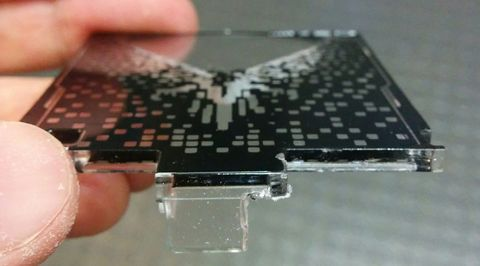

最終的な収まりはこんな感じになりました。

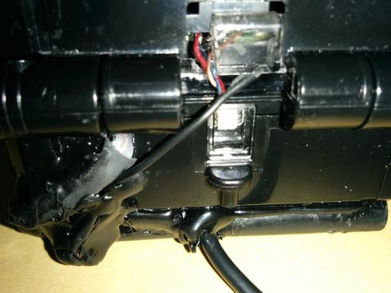

収まりっていうか、収まってないしグルーガンできったなくなっていますが、僕の実力ではこんなもの。お許しを。

よーしこれでハードは完成！！

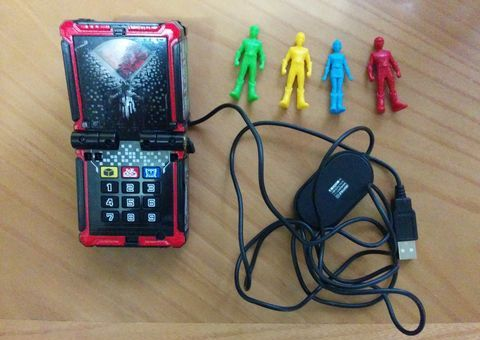

ボタンもネットも無線になってるんだから、やっぱ音声も無線にしたかったな…悔しいです！

それはともかく、上の写真をみて何か気づきませんか？

そう！フィギュアが4人しかいない！白のジュウオウタイガーアム、どっかに行ってしまったのです！(ザ・ワールドは発売時まだ登場していませんでした)


出典：[http://www.tv-asahi.co.jp/zyuoh/character/](http://www.tv-asahi.co.jp/zyuoh/character/)

いやーうっかりなくしちゃいましたー。
でも、僕のお気に入りの、八重歯のセラが無事だったからまだいいんです。アムのファンの方ごめんなさい。
きっとどっかで本能覚醒しているに違いありません。

でも、それも大事なのですが、文字盤を見てもう一つ何か気づきませんか？

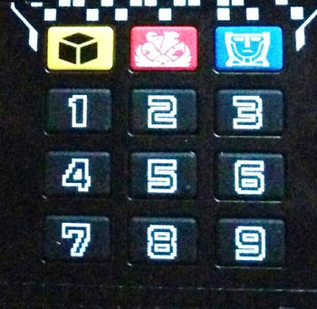

そうなんです！電話なのに「０」がないんです！
これじゃあいきなり僕に電話できないじゃないですか！

ということで、元々ある上の方のボタンの右側を０として、真ん中を「かける」ボタンにすることにしました。

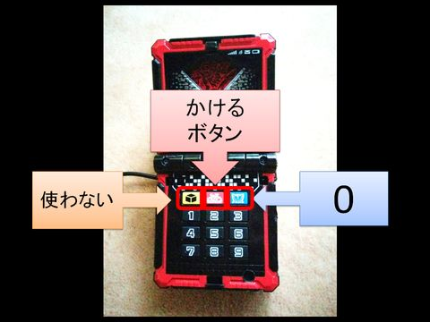

これでハードは出来上がり。ラズパイ上のソフトの設定に移ります。

# ラズパイの設定
何はともあれ最初にやることはアップデートですね。

```
$ sudo apt-get update
$ sudo apt-get upgrade
```

node.jsも0.10.29とか古いので、[ここ](https://nodejs.org/en/download/package-manager/#debian-and-ubuntu-based-linux-distributions)を参考に最新版にアップデートしてしまいましょう。

```
curl -sL https://deb.nodesource.com/setup_6.x | sudo -E bash -
sudo apt-get install -y nodejs
```

これでバージョンが６にあがります。ついでに定番のnpmも入れときます。

```
sudo apt-get install npm
```

Bluetooth関係ライブラリのインストール

```
sudo apt-get install bluetooth bluez libbluetooth-dev libudev-dev
```

USBスピーカー・マイクは挿すだけで動きますが、ラズパイ本体のオーディオがデフォルトになっているので、のちのちのSIPクライアントからのアクセスで悩まないように、[このリンク](http://superuser.com/questions/989385/alsa-base-conf-missing-in-new-raspberry-pi-raspbian-jesse)を参考に本体オーディオを止めてしまうのがお勧めです。
やり方は次の通りです。

+ /boot/config.txtを開いて、最後の「dtparam=audio=on」という行をコメントアウト
+ /lib/modprobe.d/aliases.conf を開いて、「options snd-usb-audio index=-2」という行をコメントアウト
+ sudo reboot

## 実行プログラムのクローン

そして最後に、今回の電話プログラムをダウンロードしてきます。

```
git clone https://github.com/sowd/ZyuohPhone
```

プロジェクトフォルダに入り、必要なnode.jsライブラリをインストールします。

```
cd ZyuohPhone/pi
npm install
```
設定ファイルを編集します。env.js.origをenv.jsという名前に変更してエディットしてください。中身は次のようになっています。

```
exports.ASTERISK_ADDR   = 'Set Asterisk IP address here' ;
exports.USER_NAME       = 'Set Asterisk user name here' ;
exports.USER_PASSWD     = 'Set Asterisk user password here' ;
exports.PJSUA_PATH      = './pjsip/trunk/pjsip-apps/bin/pjsua-armv7l-unknown-linux-gnueabihf' ;
```
上の三つは「[もうハマらない！Twilio × Asteriskで普通の外線電話を作る](http://qiita.com/sgrowd/items/dd1fc682718a2a623e4c)」で立てたAsteriskサーバーのIPアドレスとログイン情報を入れてください。一番下はこのままでよいです。


# 実行

Bluetoothへのアクセスに特権が必要なので、sudoします。

```
sudo node main.js
```

どうですかどうですか！？動きましたか？
これで子供に自慢しましょう！

# 苦労話

ここまでお読みいただいて、本当にありがとうございます！
これをお読み頂いたら、あたかも一本道で簡単に作れたように見えたかもしれません。

実際には、この制作には3か月近く費やしています。最初は2週間くらいでできかな…と思ってたんですがとんでもないことで、壁という壁にぶつかってしまって、一度はもう諦めようかと本気で思いました。人に聞かずにやることを心がけましたが、最終的には周りの人にも助けて頂きました。ありがとうございました。
きっとやる人がやればできることも多々含まれると思いますが、私のハックと検索能力はひどいもので、本当に自分の限界を感じてしまいました。

どんなところで苦労したのか、一応記録しておきたいと思います。

+ **どの電話を使うか**
この電話、最初は中古のガラケーを改造して作るつもりでした。しかし、本体を開けているうちに断線してしまい、萎えてしまいました。それなりに高かったのでもう一つ買う気が起きず、次はキッズケータイに楽天SIMを入れて使うことにしました。しかし、家に届いたキッズケータイを見て６歳の息子が使いたいと言いだし、召し上げられてしまいました。そこからはじめてSIPを使うという選択肢を考え始めました。その時点でSIPがなんだか全く分かっていませんでした。
+ **どのSIPクライアントを使うか**
ラズパイで動くSIPクライアントにもいろいろと選択肢があります。node.jsで作りたかったのと、オーディオ機能との兼ね合いもあって動いたり動かなかったりで、本当に苦しみました。linphone, JsSIP, npm sip, drachtio, PJSIPに入っているpythonのラッパー,sipster, 等々試しました。特にsipsterはPJSIPのラッパーなのでなんでも使えるに違いないと思ってかなり長い間頑張ったんですが、nodeならではの記法について十分なドキュメンテーションがなく、またデフォルト値もよくわからなくて苦労しました。結局一番簡単に使えてドキュメンテーションもしっかりしているのはPJSUAのCUIだったので、これを自分のプログラムの子プロセスとして起動して、標準入出力で動かすというきわわめてかっこ悪い方法にしました。きっともっといい方法があるんでしょうけど、もう途中であきらめた。
+ **BLEがわかっていない**
今回もLightBlue Beanを使ったわけですが、これを使う時にはいつもメーカーが提供していたSDKを使っていました。これはBLEをシリアル接続として使えるというもので、一切BLEを知らなくても便利に使えます。しかし今回はラズパイで動かしたかったので、素のBLEを使う必要がありました。アドバタイズモードって何？という状態から勉強する必要がありました。
+ **LightBlue Beanでキーマトリックスを読むのにパフォーマンスが足りない**
キーマトリックスの読み取りは高速に変化する電圧をタイミングよく読み取る必要があります。LightBlue Beanを普通にArduinoとして使うと、フレームレートが足りず、安定にキーを読み取ることができませんでした。結局ソフト的な後処理で乗り切りましたが、本来ならもっと高フレームレートで読むか、読み取り部分には専用ICを使うなどすべきでした。この読み取りを安定させるのに長い時間を費やしました。
+ **ラズパイでBluetoothマイクが使えなかった**
記事中でも書きましたが、BTなんて簡単に使えるんだろ等と思って[iitrust bluetooth4.1](https://www.amazon.co.jp/gp/product/B01EAKQIY2/ref=oh_aui_detailpage_o04_s00?ie=UTF8&psc=1)というコンパクトなBTモジュールまで買ってあったんです。スマホベースで作っていればよかったかなあ。おかげで有線電話になってしまいましたよ…トホホ
+ **USBヘッドセットを壊した**
スピーカー部分を引っぺがしたときに壊しました。すみません。もう一つ買いました。
+ **Twilio+Asteriskの設定がわからない**
これにも数週間を費やしました。こちらの苦労については[他の記事](http://qiita.com/sgrowd/items/dd1fc682718a2a623e4c)に書いてあります。

そんなわけで、ソフト的にもハード的にもたくさんの残骸が出ました。BTのモジュールだけは他のプロジェクトで日の目を見せてあげたいと思います。

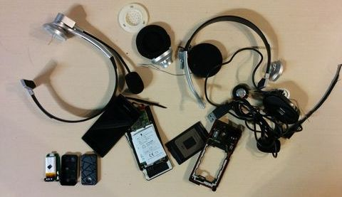

とりあえずやりきった自分をほめてあげたいです。
そしてまだ直したいこともあるけど、今度は別のことをやります。ああ疲れた！